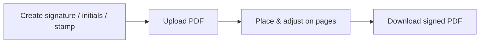

# SignPDF

> Sign, initial & stamp PDF documents — 100% in your browser. No accounts, no servers, no uploads.

## About

SignPDF lets you sign PDF documents right in your browser. Draw or upload a signature, add initials to every page, **design a realistic company stamp** (round, oval or rectangular — with curved text, ink color and natural wear), place everything precisely on your document and download the signed PDF.

Everything is processed locally with `pdf.js`, `fabric.js` and `pdf-lib`. Your files never leave your device.

## Features

### ✍️ Signatures & initials
- Draw with a smooth, pressure-friendly pad (pen color & width, HiDPI-sharp) or upload an image
- Automatic cropping of drawn signatures to their ink bounding box
- One-click "initial every page"
- Optional date/time (and opt-in IP address) caption under each signature
- Signatures and initials are remembered between visits (stored locally in your browser)

### 🏷️ Company stamp designer *(new in v2)*
- **11 country styles**: 🇫🇷 France (SIRET), 🇧🇪 Belgique, 🇨🇭 Suisse, 🇩🇪 Deutschland (Firmenstempel), 🇬🇧 UK (registered-company oval), 🇺🇸 US (corporate seal), 🇪🇸 España, 🇮🇹 Italia, 🇮🇳 India, 🇨🇳 中国 (star-center chop) and 🇯🇵 日本 (square hanko with vertical right-to-left columns)
- **Round, oval or rectangular** stamps with single or double borders
- **Curved text** along the top and bottom arcs, star/dot separators, center lines (address, SIRET, phone…)
- 5 ink colors, 3 typefaces, optional date line
- **Realistic rendering**: ink-wear speckle, fibrous streaks, uneven pressure blotches, soft ink bleed — with a "new texture" shuffle
- Optional natural tilt when placed on the page
- Export the stamp alone as a transparent PNG, or apply it to your PDF
- Your stamp design is saved locally and restored on your next visit

### 📄 Document handling
- Multi-page PDFs with fast pagination and 75%–250% zoom
- Drag, resize and rotate items directly on the page; `Delete` removes the selection
- **Lossless export**: each signature/stamp is embedded as its own high-resolution image with `pdf-lib` — the original PDF content is never rasterized or degraded

### 🎨 App
- Modern responsive UI with dark mode
- English / French interface (auto-detected, switchable)
- Pinned CDN dependencies with SRI integrity hashes
- Accessible: keyboard focus states, ARIA roles, reduced-motion support

## Quick start

1. Open `index.html` in your browser (or serve the folder with any static server)
2. Create your signature, initials and/or company stamp (step 1)
3. Upload a PDF (step 2)
4. Place your items, then **Download signed PDF** (step 3)

## Development

No build step — plain HTML/CSS/JS:

| File | Role |
|---|---|
| `index.html` | Layout, tabs and controls |
| `styles.css` | Design system (light/dark, responsive) |
| `i18n.js` | English/French dictionary |
| `stamp.js` | Stamp rendering engine (curved text, ink realism) |
| `script.js` | App logic: pads, PDF viewer, placement store, pdf-lib export |

Placements are stored in **PDF points** (scale-1 units), so zooming the viewer and exporting the file are both lossless.

## Legal note

The stamp designer is intended for creating stamps for **your own organization** (or one you are authorized to represent). Reproducing another entity's stamp or seal may be illegal.

## Browser support

Latest Chrome, Edge, Firefox and Safari.

## License

MIT License — see [LICENSE](LICENSE).

---

Made with ❤️ by [Gauthier Bros](https://github.com/BrosG) — private by design.
